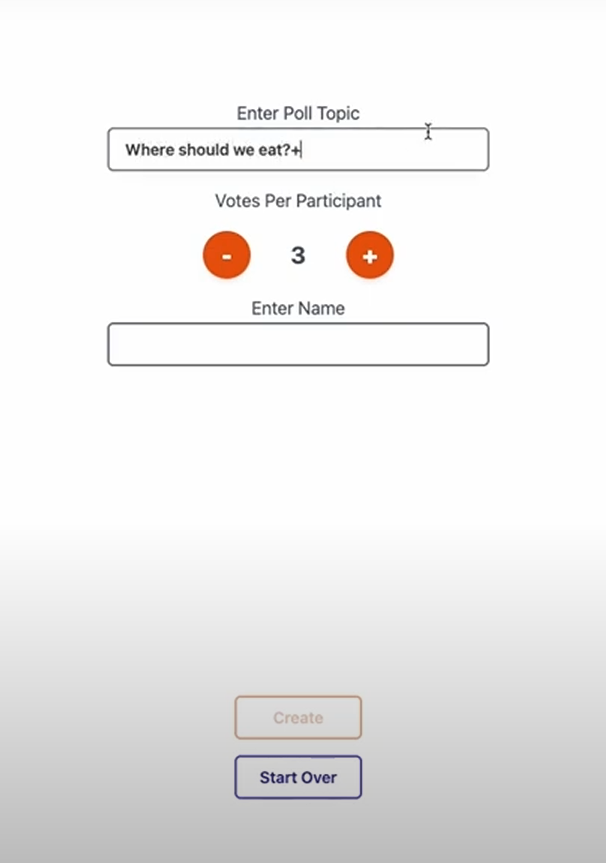
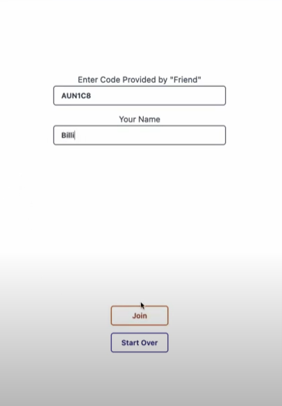
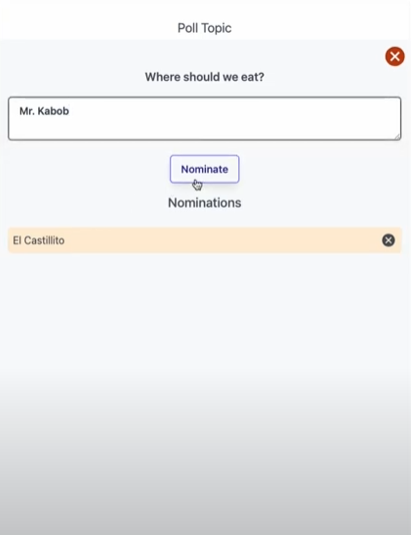
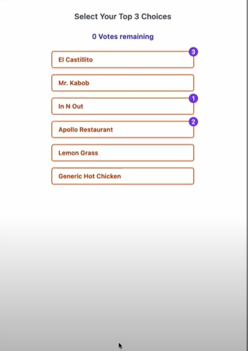
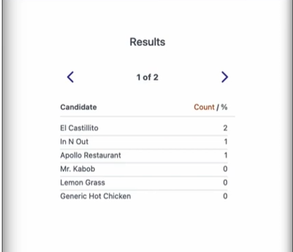

# Rankr Project
Rankr is a web-based application designed to facilitate real-time decision-making and collaboration through polls. The platform allows users to create, join, and participate in polls where they can nominate options and rank their top choices. The results are automatically calculated and displayed, providing a seamless and interactive experience. The application is built using modern web technologies, ensuring responsiveness and user-friendly interaction across devices. With real-time updates and synchronization, Rankr makes it easy for groups to reach a consensus efficiently.

## How to Run

To run this project, follow these steps:

1. **Clone the Repository:**
   - Clone the repository to your local machine using the following command:
     ```bash
     git clone https://github.com/Chenry513/rankr
     ```

2. **Install Dependencies:**
   - Install the necessary dependencies by running the following command:
     ```bash
     npm install concurrently --save-dev
     ```
    - If you encounter any issues, you can run:
      ```bash
      npm audit fix
      ```
      
3. **Run the Application:**
   - Start the application by running the following command:
     ```bash
     npm run start
     ```
   - Open your web browser and go to http://localhost:8080/ to view and interact with the Rankr application.

By following these steps, you will be able to set up and run the Netflix Recommendation System on your local machine.

## Visual Representation of Rankr Polling Process

1. **Starting a Poll with its Topic**  
   

2. **Poll ID Creation for Sharing**  
   

3. **Joining the Poll Using Poll ID**  
   

4. **User Submitting a Poll Topic**  
   

5. **Ranking Selections After Voting Starts**  
   

6. **Displaying Results After Poll Ends**  
   


